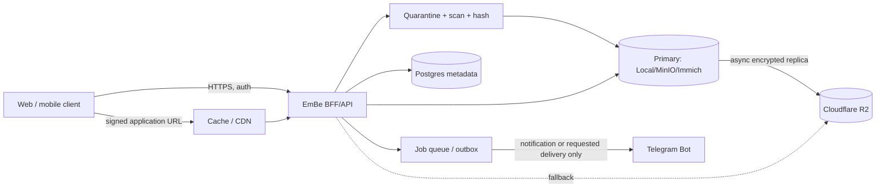

# Đánh giá kiến trúc Telegram làm lớp lưu trữ file/media

**Ngày kiểm tra:** 2026-08-30
**Tài liệu Telegram hiện hành:** Bot API 10.3, phát hành 2026-08-24
**Phạm vi:** ảnh, video, tài liệu và file upload của hệ thống EmBe

> Tài liệu này đánh giá **Bot API**. PoC mới dùng dedicated Premium user qua
> MTProto được tách riêng, vẫn lab-only, tại
> [`storage-poc-benchmark.md`](./storage-poc-benchmark.md) và
> [`free-first-storage-repositories.md`](./free-first-storage-repositories.md).
> Việc thử MTProto không đảo ngược kết luận no-go cho Bot API production. Kế
> hoạch Bot API ở mục 19–20 được giữ làm lịch sử so sánh và đã bị PoC MTProto
> mới thay thế; không được dùng làm runbook hiện hành.

## Kết luận điều hành

**Không chọn Telegram làm `primary storage`, backup/cold tier có hệ thống, hoặc origin cho CDN của EmBe.** Đây không chỉ là vấn đề giới hạn kỹ thuật:

1. Telegram Bot Developer Terms cấm dùng Bot Platform cùng frontend bên ngoài để xây dịch vụ lệch khỏi mục đích của bot và nêu đích danh ví dụ **“cloud storage sites”**.
2. Telegram tuyên bố có thể xóa hoặc làm mất truy cập chat, message, media và file bất kỳ lúc nào; không bảo đảm dữ liệu còn tồn tại, nguyên vẹn hay phù hợp một mục đích cụ thể.
3. Bot API không thể liệt kê lại toàn bộ lịch sử channel để khôi phục mapping. Pending update chỉ được giữ tối đa 24 giờ.
4. Bot API thông thường chỉ xóa được message dưới 48 giờ. Vì vậy không thể bảo đảm garbage collection hoặc yêu cầu xóa dữ liệu cũ.
5. Private channel là cloud chat, không phải Secret Chat và không có end-to-end encryption. Bot không tham gia Secret Chat.

Các điểm trên được Telegram công bố trong [Bot Developer Terms](https://telegram.org/tos/bot-developers), [Bot API](https://core.telegram.org/bots/api), [Bots FAQ](https://core.telegram.org/bots/faq) và [Privacy Policy](https://telegram.org/privacy).

**Kiến trúc production được đề xuất:**

- Bản gốc trên `LocalStorage/MinIO` hoặc filesystem do Immich quản lý.
- Bản ngoài nhà mã hóa trên Cloudflare R2; S3 là phương án thay thế.
- Telegram chỉ dùng cho thông báo và gửi một bản dẫn xuất nhỏ khi người dùng chủ động yêu cầu trong Telegram.
- Vẫn xây abstraction `StorageProvider`, nhưng `TelegramStorage` chỉ được bật trong PoC dùng file giả, không phải provider production.



## 1. Phán quyết theo tình huống

| Tình huống | Telegram đáng dùng? | Quyết định |
|---|---:|---|
| Bot gửi thông báo có ảnh preview hoặc PDF do người dùng yêu cầu | Có | Dùng Telegram-native, không coi là storage |
| PoC provider abstraction với dữ liệu giả | Có điều kiện | Channel riêng, quota thấp, kill switch |
| Bản duy nhất của ảnh/video gia đình | Không | Rủi ro mất dữ liệu và không có SLA |
| Secondary/cold backup tự động | Không | Vẫn gần use case “cloud storage site”; không bảo đảm delete/recovery |
| Origin cho web app/CDN | Không | Điều khoản nêu đích danh frontend cloud storage |
| Hồ sơ sức khỏe, giấy tờ, dữ liệu trẻ em nhạy cảm | Tuyệt đối không | Dùng storage kiểm soát được và mã hóa client/server-side |
| Gửi một media đã chọn cho ông bà qua Telegram | Có | Chỉ bản nén/derivative đã được chủ dữ liệu đồng ý |

## 2. Public Bot API và Local Bot API Server

| Khả năng | Public Bot API | Local Bot API `--local` |
|---|---:|---:|
| Upload file thông thường | 50 MB | 2,000 MB |
| Download qua `getFile` | 20 MB | Không giới hạn theo tài liệu |
| Upload từ local path | Không | Có |
| `file_path` | Đường dẫn dùng để tạo URL có token | Absolute local path có thể đọc trực tiếp |
| Webhook | HTTPS, cổng giới hạn | HTTP, bất kỳ cổng; cần TLS proxy nếu expose |
| Credential thêm | Bot token | Bot token + Telegram `api_id` + `api_hash` |
| Nơi lưu bền | Telegram, không SLA | Vẫn là Telegram; local server chỉ là gateway/cache |

Nguồn giới hạn: [Telegram Bot Features](https://core.telegram.org/bots/features), [Bot API](https://core.telegram.org/bots/api) và [official Local Bot API Server](https://github.com/tdlib/telegram-bot-api).

Local server giải quyết transfer limit, không biến Telegram thành MinIO tự host. Trước khi chuyển từ public endpoint sang local server phải gọi `logOut`; sau đó không thể đăng nhập lại cloud Bot API trong 10 phút. Không chạy hai đầu nhận update song song với kỳ vọng không mất sự kiện.

## 3. Luồng upload khả thi cho một PoC

Luồng dưới đây dùng để kiểm tra abstraction, không phải phê duyệt Telegram production:

1. Client gọi `POST /v1/uploads` với filename, MIME, size và checksum dự kiến.
2. Backend xác thực tenant, quota, allowlist MIME và tạo `asset_id`, `upload_session_id` cùng idempotency key.
3. Client upload vào vùng quarantine của backend; không proxy một request nhiều GB trực tiếp đến Telegram.
4. Worker kiểm tra magic bytes, malware, kích thước thực, SHA-256/BLAKE3 và tạo derivative.
5. Backend ghi bản canonical vào Local/MinIO, rồi commit metadata bằng outbox transaction.
6. Nếu PoC Telegram được bật, worker mã hóa từng chunk, upload qua Local Bot API và gửi caption manifest tối thiểu.
7. Mỗi response `Message` được lưu ngay: `chat_id`, `message_id`, `file_id`, `file_unique_id`, size và chunk index.
8. Worker đọc lại/verify ciphertext hash trước khi đánh dấu replica `available`.

Các trạng thái tối thiểu:

```text
initiated -> uploading -> quarantined -> primary_available
          -> rejected
primary_available -> replicating -> available | retry_wait | failed
available -> deleting -> tombstoned
```

Phải dùng outbox và idempotency; retry upload không được tạo message mới âm thầm. Với 429, tôn trọng `retry_after`, exponential backoff có jitter và circuit breaker.

## 4. Luồng download và không làm lộ token

Frontend chỉ nhận URL thuộc EmBe, ví dụ:

```http
GET /v1/files/01K.../content
Authorization: Bearer <family-session>
Range: bytes=1048576-2097151
```

Backend thực hiện:

1. Xác thực user, tenant, quyền xem asset và thời hạn chia sẻ.
2. Chọn replica khỏe theo thứ tự `local -> R2 -> S3`; Telegram không nằm trong đường production.
3. Trả `ETag`, `Content-Length`, `Content-Type`, `Content-Disposition` và hỗ trợ Range từ provider có khả năng range-read.
4. Với derivative được phép cache, cấp signed URL ngắn hạn hoặc signed cookie. Cache key phải gồm tenant, object version và variant.
5. Không redirect browser tới `https://api.telegram.org/file/bot<TOKEN>/...`; URL này chứa bot token và chỉ có hiệu lực tối thiểu một giờ.

Nếu đang chạy PoC Telegram, BFF gọi `getFile(file_id)`, đọc absolute path từ Local Bot API hoặc fetch vào private cache, rồi stream lại. Client không bao giờ thấy Bot Token, Telegram URL, `chat_id` hay `message_id`.

## 5. Cách lấy lại file và ý nghĩa các định danh

| Trường | Dùng để làm gì | Không được dùng như |
|---|---|---|
| `file_id` | `getFile`, resend file đã có trên Telegram; có thể coi persistent | ID portable sang bot khác |
| `file_unique_id` | Dedupe/index phụ, dự kiến ổn định qua bot và thời gian | Locator để download/reuse |
| `chat_id + message_id` | Anchor của message; copy/forward | Global file ID |
| `file_path` | URL/path download tạm thời | Metadata bền hoặc public URL |

Chi tiết quan trọng:

- Một file có thể có nhiều `file_id`; `file_id` gắn với bot cụ thể.
- `getFile` có thể không giữ original filename/MIME; lưu chúng ngay khi nhận message.
- `copyMessage` nhân bản message không kèm link nguồn; `forwardMessage` giữ quan hệ nguồn. Cả hai chuyển message trong Telegram, không trả byte cho frontend.
- `copyMessages`/`forwardMessages` xử lý tối đa 100 message ID/lần.
- Bot API không có phương thức tổng quát để enumerate toàn bộ channel history. `channels.getMessages` vẫn cần biết message IDs; `messages.getHistory` là user-only. Không dùng userbot/MTProto để lách giới hạn vì tăng rủi ro khóa tài khoản và vận hành credential người dùng.

## 6. Channel, group và sharding

Nếu chỉ xét PoC:

- **Private channel** phù hợp nhất: log append-only sạch, message ID tuần tự, chỉ bot/admin đăng.
- **Private supergroup** chỉ phù hợp nếu cần thảo luận, topic hoặc nhiều người đăng; dễ sinh message không thuộc storage và quyền phức tạp hơn.
- **Nhiều channel** chỉ nên chia theo tenant có yêu cầu cô lập cao, loại dữ liệu hoặc epoch vận hành. Không dùng sharding để né rate limit.

Không có tài liệu chính thức về dung lượng tối đa mỗi channel hay throughput media. Vì vậy channel không phải bucket có capacity planning. Với EmBe, nếu PoC thì chỉ một private channel chứa file giả; không kết nối vào portal.

## 7. Schema provider-neutral

Không đặt `telegram_file_id` trực tiếp trên bảng `assets`. Logical asset và physical replica phải tách nhau:

```sql
create table assets (
  id uuid primary key,
  tenant_id uuid not null,
  owner_id uuid not null,
  logical_name text not null,
  media_type text not null,
  byte_size bigint not null check (byte_size >= 0),
  plaintext_sha256 bytea not null,
  status text not null check (status in
    ('uploading','quarantined','available','deleting','tombstoned','rejected')),
  retention_class text not null,
  version bigint not null default 1,
  created_at timestamptz not null default now(),
  deleted_at timestamptz
);

create unique index assets_tenant_hash_version_uq
  on assets (tenant_id, plaintext_sha256, version);

create table asset_variants (
  id uuid primary key,
  asset_id uuid not null references assets(id),
  kind text not null,             -- original, thumbnail, preview, hls_manifest, hls_segment
  format text,
  width integer,
  height integer,
  duration_ms bigint,
  unique (asset_id, kind, format, width, height)
);

create table storage_objects (
  id uuid primary key,
  asset_id uuid not null references assets(id),
  variant_id uuid references asset_variants(id),
  provider text not null,         -- local, minio, r2, s3, telegram_poc
  provider_account_id text not null,
  bucket text,
  object_key text,
  provider_ref jsonb not null default '{}',
  byte_size bigint not null,
  ciphertext_sha256 bytea,
  etag text,
  state text not null check (state in
    ('pending','uploading','available','retry_wait','failed','deleting','deleted')),
  is_primary boolean not null default false,
  verified_at timestamptz,
  created_at timestamptz not null default now(),
  deleted_at timestamptz,
  unique (provider, provider_account_id, bucket, object_key)
);

create unique index one_primary_replica_per_asset
  on storage_objects (asset_id) where is_primary and state <> 'deleted';

create table encryption_envelopes (
  storage_object_id uuid primary key references storage_objects(id),
  algorithm text not null,
  key_version text not null,
  wrapped_dek bytea not null,
  chunk_size integer not null,
  stream_header bytea,
  aad_version integer not null default 1
);

create table telegram_locations (
  storage_object_id uuid primary key references storage_objects(id),
  bot_identity text not null,
  chat_id bigint not null,
  message_id bigint not null,
  file_id text not null,
  file_unique_id text not null,
  media_kind text not null,
  chunk_index integer not null default 0,
  chunk_count integer not null default 1,
  unique (bot_identity, chat_id, message_id),
  unique (storage_object_id, chunk_index)
);

create table storage_outbox (
  id uuid primary key,
  operation text not null,
  storage_object_id uuid not null references storage_objects(id),
  idempotency_key text not null unique,
  attempts integer not null default 0,
  next_attempt_at timestamptz not null default now(),
  last_error text,
  created_at timestamptz not null default now()
);
```

Nếu dùng Supabase, bật RLS trên mọi bảng có `tenant_id`; service role chỉ tồn tại trong backend. `provider_ref` phải được validate theo provider và các secret bên trong phải mã hóa, không trả ra API.

## 8. `StorageProvider` abstraction

```ts
type ByteRange = { start: bigint; endInclusive: bigint };

type StorageCapabilities = {
  rangeRead: boolean;
  multipartUpload: boolean;
  presignedRead: boolean;
  nativeChecksum: boolean;
  maxObjectBytes: bigint | null;
};

type ObjectRef = {
  provider: "local" | "minio" | "r2" | "s3" | "telegram_poc";
  accountId: string;
  bucket?: string;
  key?: string;
  opaque?: Record<string, string | number>;
};

interface StorageProvider {
  readonly capabilities: StorageCapabilities;
  put(
    ctx: RequestContext,
    body: AsyncIterable<Uint8Array>,
    options: PutOptions,
  ): Promise<{ ref: ObjectRef; size: bigint; etag?: string }>;
  open(
    ctx: RequestContext,
    ref: ObjectRef,
    range?: ByteRange,
  ): Promise<{ body: AsyncIterable<Uint8Array>; size: bigint; contentRange?: string }>;
  stat(ctx: RequestContext, ref: ObjectRef): Promise<ObjectStat>;
  verify(ctx: RequestContext, ref: ObjectRef, expected: Digest): Promise<VerifyResult>;
  delete(ctx: RequestContext, ref: ObjectRef): Promise<void>;
  health(): Promise<ProviderHealth>;
}
```

`TelegramStorage.capabilities` phải khai báo trung thực: `rangeRead=false`, `presignedRead=false`, `nativeChecksum=false`, `maxObjectBytes=50MB` hoặc `2000MB` tùy endpoint. `delete` là best-effort và phải thất bại rõ ràng nếu message quá 48 giờ.

## 9. API đề xuất

```text
POST   /v1/uploads
PUT    /v1/uploads/:uploadId/parts/:partNumber
POST   /v1/uploads/:uploadId/complete
DELETE /v1/uploads/:uploadId

GET    /v1/files/:fileId
GET    /v1/files/:fileId/content
DELETE /v1/files/:fileId
POST   /v1/files/:fileId/restore
GET    /v1/files/:fileId/replicas

POST   /v1/admin/files/:fileId/replicas/r2
POST   /v1/admin/files/:fileId/replicas/telegram-poc
POST   /v1/admin/storage/reconcile
GET    /v1/admin/storage/health
```

`POST /v1/uploads` trả upload session và URL/part plan, không trả provider credential dài hạn. `DELETE` chỉ tạo tombstone và outbox; worker xóa từng replica, ghi audit và chỉ hoàn tất khi policy cho phép.

## 10. Cache, CDN, video và Range Request

Telegram không phải HTTP range origin đáng tin cậy. `getFile` chỉ cấp file/path; tài liệu không cam kết Range, cache-control, ETag hay bandwidth. Kiến trúc media production:

- Lưu original bit-exact làm `Document`, không dùng Telegram Photo/Video cho bản gốc vì client/server có thể tạo/transcode derivative.
- Dùng `libvips`/`sharp` cho thumbnail AVIF/WebP/JPEG.
- Dùng FFmpeg tạo MP4 fast-start hoặc HLS/DASH; manifest và segment nằm ở Local/R2.
- Browser seek video bằng Range từ Local/R2 hoặc qua Cloudflare CDN.
- File mã hóa được cache theo ciphertext. Cache không giữ plaintext lâu hơn request nếu không có disk-encryption và eviction policy rõ ràng.

Nếu buộc thử Telegram, worker phải tải trọn chunk về private cache rồi phục vụ Range từ cache. Chia file lớn thành chunk 64–256 MB chỉ giúp retry/streaming của PoC, không khắc phục điều khoản hoặc durability.

## 11. Encryption và quản lý khóa

Thiết kế khuyến nghị là envelope encryption:

1. Mỗi object tạo một DEK ngẫu nhiên.
2. Mã hóa stream bằng `crypto_secretstream_xchacha20poly1305` hoặc AEAD chunked đã review.
3. KEK nằm trong KMS/Vault hoặc secret store tách biệt; DB chỉ lưu `wrapped_dek` và `key_version`.
4. Mỗi chunk xác thực độc lập; AAD gồm `tenant_id`, `asset_id`, `version`, `variant`, `chunk_index`, plaintext size.
5. Không tái sử dụng nonce với cùng key. Nếu tự triển khai AES-GCM chunked, nonce phải được dẫn xuất an toàn từ nonce gốc + chunk index; ưu tiên thư viện có construction sẵn như [libsodium secretstream](https://doc.libsodium.org/secret-key_cryptography/secretstream).
6. Lưu plaintext hash để kiểm tra end-to-end và ciphertext hash để kiểm tra transport/storage. Với yêu cầu chống lộ equality, mã hóa/HMAC metadata hash thay vì public hash.
7. Khi decrypt, chỉ phát plaintext của chunk sau khi authentication tag đã verify.

Secretstream tuần tự phù hợp download từ đầu. Nếu cần arbitrary Range hiệu quả, mỗi chunk phải là một AEAD record độc lập có index; plaintext range được map sang các chunk và overfetch hai biên.

Mã hóa payload không che được toàn bộ metadata: Telegram vẫn có thể biết bot/channel, thời gian, kích thước, số message và pattern truy cập. Filename/caption nên opaque và không chứa tên trẻ, hồ sơ y tế hoặc tenant identity.

## 12. Độ bền, backup metadata và khôi phục

Telegram không thể là một trong ba bản sao 3-2-1 được tin cậy. Production dùng:

- Copy 1: original trên disk/NAS do Immich/MinIO quản lý.
- Copy 2: snapshot trên ổ khác hoặc NAS khác.
- Copy 3: encrypted Restic repository trên R2/S3 ngoài nhà.
- Postgres: daily logical dump + WAL/physical backup; manifest export append-only; cả hai nằm ngoài Telegram.
- Hằng tháng restore drill một mẫu asset, derivative, DB và encryption key version.

Không thể khôi phục đầy đủ nếu chỉ còn Telegram:

- Pending updates hết sau 24 giờ.
- Bot API không enumerate toàn bộ history.
- `file_unique_id` không download được.
- Caption có thể giúp nhận dạng thủ công nhưng không thay metadata backup.

Nếu PoC vẫn upload, caption chỉ chứa manifest không nhạy cảm đã ký, ví dụ `asset_id`, version, chunk index/count, ciphertext hash và key version. Manifest chuẩn vẫn phải backup ngoài Telegram.

## 13. Delete, soft delete, GC và orphan

Luồng production:

1. `DELETE` chuyển asset sang `deleting`, thu hồi share link và chặn read mới.
2. Ghi tombstone cùng retention deadline; cho phép undo trong grace period nếu policy cho phép.
3. Worker xóa derivative/cache trước, rồi từng replica; ghi result và audit.
4. Asset chuyển `tombstoned` khi mọi provider xác nhận xóa hoặc có exception được phê duyệt.
5. Reconciler quét object listing của S3/R2/MinIO để tìm DB-missing và object-missing.

Telegram phá vỡ quy trình này vì message thường chỉ xóa được trong 48 giờ và Bot API không list toàn bộ history. Một Telegram replica cũ có thể không xóa được bằng bot; đây là blocker với dữ liệu cần quyền xóa.

## 14. Multi-tenant và chống lạm dụng

- Mỗi request mang `tenant_id` từ session đã xác thực; không tin tenant gửi trong body.
- Row-level authorization tại API và RLS trong Postgres.
- Object key opaque: `tenant/<tenant_uuid>/<asset_uuid>/<version>/<variant>`.
- DEK mỗi object; KEK hoặc key hierarchy tách theo tenant có độ nhạy cao.
- Quota byte, file count, daily upload, concurrency và derivative CPU cho từng tenant.
- Per-tenant queue/fair scheduling để một khách hàng không làm nghẽn worker.
- MIME allowlist + magic-byte check + antivirus + archive bomb protection + timeout.
- Audit mọi download, delete, key unwrap và admin action.
- Channel không phải security boundary. Nếu bot token lộ, attacker có thể hành động với toàn bộ channel mà bot có quyền.

## 15. Dữ liệu tuyệt đối không lưu theo mô hình Telegram Storage

- Hồ sơ khám thai, chẩn đoán, đơn thuốc, kết quả xét nghiệm, thông tin định danh.
- Ảnh/video riêng tư hoặc nhạy cảm của trẻ và mẹ; nội dung của người chưa đồng ý.
- Token, private key, password database, key backup đặt cùng ciphertext.
- Tài liệu tài chính, pháp lý hoặc dữ liệu chịu yêu cầu retention/delete nghiêm ngặt.
- Dataset dùng huấn luyện AI, dữ liệu scraping, nội dung bất hợp pháp/vi phạm bản quyền.
- Bản duy nhất của bất kỳ file nào không thể tái tạo.

## 16. Rate limit, timeout và capacity planning

Hướng dẫn chính thức hiện có:

- Một chat: tránh quá 1 message/giây.
- Group: khoảng 20 message/phút.
- Broadcast miễn phí: khoảng 30 message/giây.
- Vượt ngưỡng: HTTP 429 và `retry_after`.

Telegram không công bố SLA, media bandwidth, upload/download concurrency an toàn hoặc quota theo channel. Không thiết kế capacity production từ các con số truyền miệng “unlimited”. Worker PoC nên khởi đầu 1 upload/chat, 2 download tổng, timeout theo chunk và quota vài GB/ngày; benchmark bằng dữ liệu giả và dừng khi có 429/5xx kéo dài.

Không tạo nhiều bot/channel để né flood control hoặc moderation; điều khoản cấm circumvent rate limits và có thể dẫn đến khóa bot/account/channel.

## 17. Failure scenarios và phản ứng bắt buộc

| Sự cố | Phát hiện | Phản ứng |
|---|---|---|
| Telegram API down/timeout | health probe, error-rate, circuit breaker | Không ảnh hưởng primary; queue notification/PoC job |
| 429 | `retry_after` | Pause đúng thời gian, jitter, không retry storm |
| Bot bị kick/mất quyền | `my_chat_member`, `getChatMember` | Disable provider, cảnh báo; không thử channel khác để lách |
| Token lộ/mất | secret scan, auth errors | Revoke/rotate qua BotFather; test lại file IDs của cùng bot |
| Bot bị xóa/tạo bot mới | identity mismatch | `file_id` cũ không portable; phục hồi từ primary/R2 |
| `file_id` invalid | `getFile` 400/404 | Mark replica corrupt/missing, rebuild từ canonical provider |
| Channel restricted/banned | upload/copy failures, membership state | Disable; báo incident; không coi Telegram là recovery source |
| DB mất mapping | DB restore/manifest checksum | Restore backup ngoài Telegram; channel đơn lẻ không đủ |
| DB có row nhưng file mất | scheduled verify/sample read | Failover replica, repair asynchronously |
| Retry tạo duplicate message | idempotency conflict | Reconcile response trước retry; lưu operation ID/outbox |
| Local Bot API disk đầy | disk metrics, temp-file errors | Stop intake, clean cache có kiểm soát; primary không phụ thuộc |
| Delete quá 48 giờ thất bại | provider delete result | Ghi compliance exception; lý do loại provider khỏi production |
| Encryption key mất | key restore test | Không thể decrypt; backup KEK tách biệt, dual control |

## 18. Chi phí tham chiếu

Giả định 100 GB, 1 TB = 1,000 GB, 10 TB = 10,000 GB được lưu trọn tháng; chưa gồm request, replication và thuế.

| Dung lượng | Telegram | R2 Standard sau free tier 10 GB | AWS S3 Standard, mức tham chiếu US East |
|---:|---:|---:|---:|
| 100 GB | $0 trực tiếp nhưng không có SLA/quyền sử dụng storage | $1.35/tháng | khoảng $2.50/tháng |
| 1 TB | như trên | $14.85/tháng | khoảng $25/tháng |
| 10 TB | như trên | $149.85/tháng | khoảng $250/tháng |

R2 hiện tính $0.015/GB-tháng, 1 triệu Class A và 10 triệu Class B đầu mỗi tháng miễn phí, egress Internet miễn phí; xem [R2 pricing](https://developers.cloudflare.com/r2/pricing/). Bảng AWS dùng S3 Standard Singapore khoảng $0.025/GB-tháng và chưa gồm request/egress; xem [S3 pricing](https://aws.amazon.com/s3/pricing/). Repo MinIO Community đã archive ngày 2026-04-25 và không còn maintained; không chọn cho triển khai mới. Với một node EmBe, `LocalStorage + restic + R2/B2` đơn giản hơn một distributed object store tự host.

Với hàng triệu file nhỏ, số request/list/head, metadata rows, backup catalog và GC thường quan trọng hơn số GB. Telegram còn biến mỗi object/chunk thành message, nên giới hạn message và khả năng recovery trở thành bottleneck không định lượng được. “Miễn phí” không bù được rủi ro khóa hoặc mất toàn bộ dữ liệu.

## 19. PoC thực tế, an toàn và có tiêu chí dừng

Mục đích PoC là kiểm tra `StorageProvider` và chứng minh các giới hạn, không đưa Telegram vào EmBe production.

### Phạm vi

- 100 file synthetic: 1 KB–1.9 GB; không có dữ liệu người dùng.
- Một bot và một private channel riêng; bot chỉ có quyền cần thiết.
- Local Bot API chạy private network, không expose Internet; token/API hash từ secret store.
- Quota cứng 5 GB/ngày, concurrency 1 upload, 2 download.
- Kill switch `TELEGRAM_POC_ENABLED=false` mặc định.

### Test bắt buộc

1. Upload/download/hash round-trip ở các mốc 20 MB, 50 MB, 2,000 MB.
2. Reuse `file_id`; copy/forward; rotate token của cùng bot và ghi nhận kết quả.
3. 429/backoff, timeout giữa chunk, restart worker và idempotent resume.
4. Kick/re-add bot, mất quyền admin, channel unavailable.
5. Delete dưới/trên 48 giờ.
6. Mất DB test rồi thử recovery chỉ từ manifest để chứng minh gap.
7. Range request qua cache, video seek, cache eviction.
8. Encrypt/decrypt chunk, corrupt byte/tag và mất key version.

### Go/no-go

PoC chỉ được coi là hoàn tất khi abstraction, outbox, encryption và failure handling hoạt động. **Kết quả không thay đổi quyết định no-go cho Telegram production**, trừ khi Telegram sửa điều khoản bằng văn bản và công bố API/SLA/delete/recovery phù hợp.

## 20. Roadmap production đề xuất cho EmBe

### Phase A — Canonical storage

- Giữ Immich originals trên storage local/NAS có SMART, snapshot và UPS.
- Dùng provider-neutral schema cùng Local/R2 adapters.
- Upload quarantine, MIME validation, hash, derivative và outbox.

### Phase B — Offsite và phục hồi

- Kích hoạt R2 billing/free tier, tạo private bucket và scoped API token.
- Restic encrypted backup DB/config/media hoặc replicate canonical objects theo policy.
- Tạo restore drill và báo cáo checksum định kỳ.

### Phase C — Delivery

- BFF cấp signed app URL; thumbnail/HLS qua Cloudflare cache.
- Không lộ origin credential hoặc internal object key.
- Telegram bot chỉ nhận notification job và gửi derivative/PDF khi người dùng yêu cầu.

### Phase D — Optional lab

- Cài Local Bot API riêng trong profile `lab`.
- Chạy test synthetic ở mục 19; không gắn với tenant production.
- Lưu kết quả benchmark và incident log, rồi tắt lab mặc định.

## Claim-to-source ledger

| Claim quan trọng | Nguồn chính | Mức tin cậy |
|---|---|---:|
| Bot + external frontend không được dùng như cloud storage site | [Telegram Bot Developer Terms](https://telegram.org/tos/bot-developers) | Rất cao |
| Telegram có thể xóa/làm mất truy cập file và không bảo đảm persistence/integrity | [Telegram Bot Developer Terms](https://telegram.org/tos/bot-developers) | Rất cao |
| Public download 20 MB, upload 50 MB; Local download unlimited, upload 2,000 MB | [Bot API](https://core.telegram.org/bots/api), [Bot Features](https://core.telegram.org/bots/features) | Rất cao |
| `file_id` persistent; `file_unique_id` không download/reuse | [Bots FAQ](https://core.telegram.org/bots/faq), [Bot API](https://core.telegram.org/bots/api) | Rất cao |
| Pending updates chỉ giữ 24 giờ | [Bot API](https://core.telegram.org/bots/api) | Rất cao |
| Bot API delete message thường giới hạn 48 giờ | [Bot API](https://core.telegram.org/bots/api) | Rất cao |
| Cloud chat không E2EE; chỉ Secret Chat dùng E2EE | [Telegram Privacy Policy](https://telegram.org/privacy) | Rất cao |
| R2 $0.015/GB-tháng, free 10 GB và egress miễn phí | [Cloudflare R2 pricing](https://developers.cloudflare.com/r2/pricing/) | Rất cao |
| S3 Standard thiết kế 11 số 9 durability, 99.99% availability | [AWS S3 data protection](https://docs.aws.amazon.com/AmazonS3/latest/userguide/DataDurability.html) | Rất cao |
| Secretstream hỗ trợ authenticated streaming và tự quản lý nonce/rekey | [libsodium secretstream](https://doc.libsodium.org/secret-key_cryptography/secretstream) | Cao |

## Điểm còn phải benchmark, không được đoán

- Media bandwidth và concurrency an toàn của Telegram không được công bố.
- `file_id` sau khi rotate token của cùng bot chưa có bảo đảm rõ trong tài liệu.
- Hiệu năng Local Bot API với file gần 2 GB trên chính phần cứng EmBe.
- Chi phí S3 chính xác phải chọn region và traffic profile; bảng trên chỉ là mức US East tham chiếu.

Các khoảng trống này không làm thay đổi quyết định production vì điều khoản, durability, recovery và delete đã là blocker độc lập.
