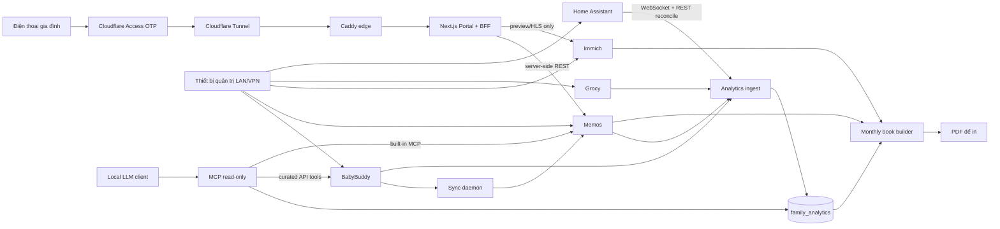

# Em Bé Family Data Platform Implementation Plan

> **For agentic workers:** REQUIRED SUB-SKILL: Use superpowers:subagent-driven-development (recommended) or superpowers:executing-plans to implement this plan task-by-task. Steps use checkbox (`- [ ]`) syntax for tracking.

**Goal:** Xây dựng nền tảng self-hosted, khôi phục được và bảo vệ dữ liệu để lưu hành trình thai kỳ, chăm sóc em bé, media, môi trường phòng ngủ, vật tư và xuất sách tại `embe.hieu.asia`.

**Architecture:** Các ứng dụng nguồn giữ database riêng; mọi tích hợp gọi API và đổ dữ liệu đã chuẩn hóa vào một kho phân tích chỉ-đọc đối với AI. Chỉ Family Portal được công khai qua Cloudflare Access/Tunnel; Portal BFF giữ token Memos/Immich ở server và chỉ trả preview/timeline đã được phép xem.

**Tech Stack:** Linux, Docker Engine + Compose, Caddy, Cloudflare Tunnel/Access, BabyBuddy, Memos, Immich, Grocy, Home Assistant, Python/FastAPI/httpx/SQLAlchemy/Alembic, PostgreSQL cho analytics, Next.js TypeScript cho Portal/BFF, FastMCP, Typst, Restic.

**Spec:** `../../../report-source.md`

## Global Constraints

- Múi giờ giao diện là `Asia/Ho_Chi_Minh`; dữ liệu liên hệ giữa hệ thống lưu UTC `timestamptz` và giữ timezone nguồn.
- Chỉ `embe.hieu.asia` có public DNS route; BabyBuddy, Memos, Immich, Grocy, Home Assistant và MCP không mở trực tiếp ra Internet.
- Không nhúng PAT/API key vào browser bundle, URL query, Git repository hoặc log.
- Image Docker phải pin version/digest; không dùng `latest`, Watchtower hay auto-migrate production không kiểm soát.
- Không sửa database/schema của ứng dụng upstream. Adapter chỉ dùng documented API; direct SQL production chỉ dùng cho backup do chính ứng dụng hướng dẫn.
- MCP production mặc định read-only. Tool ghi phải là server riêng, scope riêng và cần xác nhận người dùng.
- Không tự động mua hàng. Automation tạo `purchase_proposal`; người vận hành duyệt trước khi đặt.
- Không diễn giải dữ liệu như chẩn đoán y khoa. Growth dùng thuật toán/dataset WHO đã version; feeding alert dùng ngưỡng bác sĩ cấu hình.
- Không xóa thẻ nhớ sau ingest tự động. Chỉ cho phép xóa khi có hai bản copy đã verify và người dùng xác nhận.
- Mỗi phase chỉ qua gate sau khi có bằng chứng test/restore/negative test tương ứng.

---

## 1. Kiến trúc mục tiêu



### Quyền sở hữu dữ liệu

| Domain | System of record | Portal đọc từ | Analytics nhận qua |
|---|---|---|---|
| Ngủ, bú, tã, tăng trưởng sau sinh | BabyBuddy | Không hiển thị trực tiếp | BabyBuddy REST API |
| Nhật ký, cảm xúc, milestone, thai kỳ dạng narrative | Memos | Memos REST qua BFF | Memos REST/MCP |
| Ảnh RAW, JPEG, video, khuôn mặt | Immich + filesystem originals | Immich preview/HLS qua BFF | Chỉ metadata chọn lọc |
| Tồn kho và stock movement | Grocy | Chưa cần ở portal gia đình | Grocy REST API |
| Supplier SKU, quote, lead time, landed cost | `procurement` schema | Admin UI tương lai | Nội bộ |
| Nhiệt độ, độ ẩm, ánh sáng, media state | Home Assistant | Không mặc định | WebSocket + REST reconcile |
| Dataset phân tích, feature, report | `family_analytics` | BFF chỉ đọc aggregate được phép | ETL |
| Hồ sơ tiền sản có cấu trúc (nếu cần) | `prenatal` schema | Chỉ mục đã duyệt | Form/import có validation |

## 2. Thiết kế mạng

### Phân vùng vật lý/VLAN

| Zone | Ví dụ CIDR | Thành phần | Luật chính |
|---|---|---|---|
| `trusted` | `10.20.10.0/24` | Laptop/phone quản trị | Được vào admin UI trên server; MFA/device lock |
| `server` | `10.20.20.0/24` | Docker host, NAS | Không nhận kết nối từ WAN; chỉ trusted/VPN |
| `iot` | `10.20.30.0/24` | Sensor, speaker | Chỉ DNS/NTP/MQTT/Home Assistant cần thiết; chặn sang trusted |
| `guest` | `10.20.40.0/24` | Thiết bị khách | Internet only; portal đi qua public hostname |
| `backup` | `10.20.50.0/24` hoặc link riêng | NAS/backup target | Chỉ host backup được ghi; user thường chỉ đọc hoặc không truy cập |

Nếu router chưa hỗ trợ VLAN, phase đầu thay bằng firewall host + SSID IoT riêng; VLAN là điều kiện trước khi cho thiết bị IoT không tin cậy truy cập mạng server.

### Luật firewall tối thiểu

- WAN -> home: deny toàn bộ inbound; không port-forward 80/443/2283/5230/8000/9283/8123.
- `cloudflared` -> Cloudflare: allow outbound TCP/UDP 7844 và DNS/NTP cần thiết.
- `trusted`/VPN -> server: chỉ các cổng admin được liệt kê; SSH chỉ key, không password.
- `iot` -> Home Assistant/MQTT: allow đích/cổng rõ ràng; deny `iot` -> Docker host khác.
- Server -> IoT: chỉ Home Assistant tới device cần điều khiển.
- Server -> Internet: allow update, model download và backup endpoint; log egress bất thường.

### Docker networks

| Network | Service được nối | Ghi chú |
|---|---|---|
| `edge_net` | `cloudflared`, `caddy`, `portal` | Không chứa app nguồn hoặc DB |
| `core_net` | `babybuddy`, `memos`, `grocy`, `sync-daemon`, `analytics-ingest` | `internal: true`; không publish WAN |
| `media_net` | Immich server, ML, Redis, Immich Postgres | Theo Compose chính thức; DB không nối network khác |
| `portal_data_net` | `portal`, Memos, Immich server | Chỉ BFF cần; không nối DB |
| `analytics_net` | analytics Postgres, ingest, read-only MCP, book builder | MCP không nối `core_net` nếu không dùng adapter API |
| `ops_net` | metrics/health exporters | Read metrics only |

Docker user-defined bridge cô lập container khác network theo mặc định; tránh đưa Caddy vào mọi network vì nó biến proxy thành điểm pivot. Tham chiếu: [Docker bridge](https://docs.docker.com/engine/network/drivers/bridge/).

## 3. API routing

### Public routes

| Route | Upstream | Auth | Cache | Ghi chú |
|---|---|---|---|---|
| `GET /` | Next.js Portal | Cloudflare Access | HTML private/no-store | Trang gia đình |
| `GET /api/v1/timeline` | Portal BFF -> Memos | Access + server PAT | private 30s | Cursor pagination, sanitize Markdown |
| `GET /api/v1/albums` | Portal BFF -> Immich | Access + read-only key | private 60s | Chỉ album allowlist |
| `GET /api/v1/media/:id/thumbnail` | BFF -> Immich thumbnail | Access | private, immutable theo asset version | Không trả original |
| `GET /api/v1/media/:id/video` | BFF -> Immich encoded video/HLS | Access | private | Hỗ trợ `Range`, abort/backpressure |
| `GET /api/v1/health` | Portal | Không chứa dữ liệu | no-store | Trả trạng thái portal, không lộ upstream |

Mọi route khác trả 404. Cấu hình Cloudflare cache bypass cho `/api/*`; không cache media trẻ em ở edge nếu chưa có chính sách privacy rõ ràng.

### Private routes

| Tên nội bộ | Service | Người dùng |
|---|---|---|
| `baby.home.arpa` | BabyBuddy | Bố/mẹ qua LAN/VPN |
| `memos.home.arpa` | Memos | Bố/mẹ qua LAN/VPN |
| `photos.home.arpa` | Immich | Bố/mẹ qua LAN/VPN |
| `pantry.home.arpa` | Grocy | Bố/mẹ qua LAN/VPN |
| `ha.home.arpa` | Home Assistant | Admin qua LAN/VPN |

Không tạo public DNS record cho các tên trên. Nếu cần quản trị từ xa, dùng WireGuard/Tailscale hoặc Cloudflare private application; không thêm public subdomain tạm.

### Credential matrix

| Principal | Credential | Quyền |
|---|---|---|
| `sync-daemon` | BabyBuddy token + Memos PAT riêng | BB read notes/tags; Memos create/update memo của account integration |
| `portal-bff` | Memos PAT + Immich API key riêng | Memos list/get; Immich album/read/view, không delete/upload |
| `analytics-ingest` | Token mỗi nguồn | Read only; HA chỉ entity allowlist |
| `mcp-readonly` | Analytics DB role | `SELECT` trên curated views, không raw secrets/PII tables |
| `book-builder` | Memos/Immich read token | Chỉ tháng và album được chọn |
| `backup` | Filesystem + DB dump roles | Không dùng token ứng dụng; chạy dưới service account host |

Compose secrets mount theo từng service ở `/run/secrets`; không dùng shared `.env` chứa tất cả khóa. Tham chiếu: [Docker Compose secrets](https://docs.docker.com/compose/how-tos/use-secrets/).

## 4. Cấu trúc repository dự kiến

```text
infra/
  compose/
    core.yml
    media.override.yml
    edge.yml
    analytics.yml
    observability.yml
  caddy/Caddyfile
  cloudflared/config.yml
  firewall/nftables.conf
  systemd/
    embe-backup.timer
    embe-backup.service
    embe-book.timer
    embe-book.service
  secrets/README.md
  env/*.env.example
services/
  sync-daemon/
    src/embe_sync/{main.py,config.py,models.py,ledger.py}
    src/embe_sync/adapters/{babybuddy.py,memos.py}
    src/embe_sync/jobs/{milestones.py,reconcile.py}
    tests/{test_milestone_sync.py,test_reconcile.py,test_contracts.py}
  analytics-ingest/
    src/embe_analytics/adapters/{babybuddy.py,memos.py,grocy.py,home_assistant.py}
    src/embe_analytics/jobs/{backfill.py,features.py}
    migrations/
    tests/
  mcp-readonly/
    src/embe_mcp/{server.py,tools_sleep.py,tools_growth.py,policy.py}
    tests/
  portal/
    app/{page.tsx,api/v1/...}
    lib/{auth.ts,memos.ts,immich.ts,schemas.ts}
    tests/
  procurement/
    src/embe_procurement/{reorder.py,landed_cost.py,providers/}
    tests/
  book-builder/
    src/embe_book/{extract.py,transform.py,render.py,preflight.py}
    templates/monthly-book.typ
    tests/{test_structure.py,test_golden.py}
ops/
  media/ingest_media.py
  backup/{prepare_snapshots.sh,run_restic.sh,check_restic.sh}
  restore/restore_drill.sh
  update/preflight_update.sh
  health/health_audit.sh
docs/
  architecture/{decisions.md,data-contracts.md,runbook.md}
  operations/{backup.md,restore.md,incident.md,upgrade.md}
```

---

## 5. Roadmap theo phase

| Phase | Mục tiêu | Effort tham khảo | Gate bắt buộc |
|---:|---|---:|---|
| 0 | Discovery, capacity, threat model | 2–3 ngày | ADR + capacity sheet + camera samples |
| 1 | Host, storage, network, Compose foundation | 4–6 ngày | Firewall negative test + disk/UPS alerts |
| 2 | Core services private | 4–7 ngày | CRUD + restart persistence + API contract |
| 3 | Edge `embe.hieu.asia` | 3–5 ngày | Chỉ portal public; token không ở browser |
| 4 | Backup/restore trước import | 4–6 ngày | Restore clean-room thành công |
| 5 | Media ingest và Immich tuning | 5–8 ngày | Batch RAW/4K đại diện xử lý xong |
| 6 | BabyBuddy -> Memos daemon | 5–8 ngày | Duplicate/edit/delete/retry tests |
| 7 | Analytics + Home Assistant | 8–12 ngày | Backfill/reconcile và timezone tests |
| 8 | MCP + local LLM | 5–8 ngày | Read-only/deny-write/prompt-injection tests |
| 9 | Family Portal | 8–12 ngày | Mobile UX, auth, media Range, no secret leak |
| 10 | Inventory/procurement | 6–10 ngày | Proposal đúng, không auto-checkout |
| 11 | Monthly PDF book | 6–10 ngày | Structural + visual golden QA |
| 12 | Observability, upgrade, go-live | 4–7 ngày | 7 ngày soak + incident drill |

Với một người làm part-time, dự kiến 3–4 tháng. Không chạy song song Phase 5–12 trước khi Phase 4 restore gate đạt.

### Task 1: Phase 0 — Khóa phạm vi, capacity và threat model

**Files:**
- Create: `docs/architecture/decisions.md`
- Create: `docs/architecture/data-contracts.md`
- Create: `docs/architecture/runbook.md`
- Create: `infra/env/capacity.example.env`

**Interfaces:**
- Consumes: model camera, bitrate video, media/tháng, router/VLAN capability, ISP upload, dung lượng disk hiện có.
- Produces: `MONTHLY_INGEST_GB`, `PRIMARY_USABLE_GB`, RPO/RTO và danh sách dữ liệu được phép xuất hiện trên portal.

- [ ] Ghi ADR cho từng quyết định: system of record, public/private boundary, API-over-DB, local-LLM-only và human approval cho mua hàng.
- [ ] Lấy 20 RAW và 5 video đại diện từ từng camera; ghi extension, kích thước, codec, bitrate, thời lượng và checksum.
- [ ] Tính dung lượng: `24 * monthly_ingest * 1.20 / 0.75`; hệ số 1.20 bao gồm generated media, 0.75 giữ 25% headroom. Nếu ingest 250 GB/tháng thì cần khoảng 9.6 TB usable cho 24 tháng trước RAID/backup.
- [ ] Đo tốc độ upload Internet và LAN; đặt mục tiêu portal chỉ phát 1080p encoded video, không phát original 4K/RAW.
- [ ] Lập allowlist portal: album, tag Memos, trường metadata được phép; labs, địa chỉ, GPS và ghi chú y tế mặc định bị loại.
- [ ] Ghi RPO/RTO: structured data 6 giờ/4 giờ; media 24 giờ/24 giờ; card ingest có hai bản verify trước khi xóa.
- [ ] Review threat model cho mất điện, hỏng disk, token leak, người thân mất điện thoại, ransomware, upstream schema change và Cloudflare outage.
- [ ] Commit: `docs(architecture): define embe platform boundaries`.

### Task 2: Phase 1 — Host, filesystem, VLAN và Compose foundation

**Files:**
- Create: `infra/firewall/nftables.conf`
- Create: `infra/compose/core.yml`
- Create: `infra/compose/edge.yml`
- Create: `infra/compose/analytics.yml`
- Create: `infra/env/*.env.example`
- Create: `infra/secrets/README.md`

**Interfaces:**
- Consumes: ADR và capacity từ Task 1.
- Produces: Linux host có `appdata` SSD, `media` pool, `backup-staging`, Docker networks và secret mount convention.

- [ ] Cài Linux 64-bit, Docker Engine và Compose plugin; bật time sync; đặt timezone hiển thị `Asia/Ho_Chi_Minh`.
- [ ] Tạo filesystem: SSD cho container/DB; HDD/ZFS mirror cho originals; backup target là thiết bị khác. Không đặt Immich Postgres trên network share vì tài liệu Immich yêu cầu local SSD.
- [ ] Gắn UPS và cấu hình graceful shutdown; bật SMART test, scrub và cảnh báo nhiệt độ/dung lượng.
- [ ] Cấu hình VLAN/firewall theo mục 2; không mở inbound WAN.
- [ ] Khai báo user-defined Docker networks; chỉ publish admin ports lên IP `server`, không `0.0.0.0` nếu router chưa firewall.
- [ ] Tạo từng secret file quyền `0600`, cấp riêng cho service; `.gitignore` từ chối `infra/secrets/*.txt` và backup credential.
- [ ] Thêm healthcheck/restart policy/log rotation cho từng service; giới hạn log để không lấp SSD.
- [ ] Verify từ guest/IoT rằng admin ports bị chặn; verify từ trusted rằng được vào; verify từ Internet không có port origin.
- [ ] Commit: `feat(infra): add isolated compose foundation`.

### Task 3: Phase 2 — Deploy core services ở private network

**Files:**
- Modify: `infra/compose/core.yml`
- Create: `infra/compose/media.override.yml`
- Create: `docs/operations/upgrade.md`
- Create: `services/sync-daemon/tests/fixtures/*.json`

**Interfaces:**
- Consumes: persistent volumes và networks Task 2.
- Produces: BabyBuddy, Memos, Immich, Grocy chạy private; API schema snapshot dùng làm contract fixture.

- [ ] Deploy BabyBuddy bằng SQLite trên SSD ở quy mô gia đình; tạo account người dùng và token integration riêng.
- [ ] Deploy Memos bằng SQLite WAL; private mode, tắt registration/public memo; tạo PAT riêng cho sync, portal và book-builder.
- [ ] Deploy Immich từ Compose chính thức; giữ Postgres image riêng của Immich, DB trên SSD, originals trên media pool; pin release/digest.
- [ ] Deploy Grocy với persistent `/config`; đổi default password; tạo API key read-only nếu quyền phiên bản hỗ trợ, nếu không tạo user integration tối thiểu.
- [ ] Tạo `milestone` tag trong BabyBuddy; quy ước milestone là Note có tag đó. Thai kỳ narrative dùng Memos tags `pregnancy`, `appointment`, `ultrasound`.
- [ ] Gọi `OPTIONS`/OpenAPI của từng app đang chạy, lưu fixture cần thiết cho adapter contract tests; không copy toàn bộ spec khổng lồ vào repo nếu chỉ dùng vài endpoint.
- [ ] Restart toàn bộ host; verify dữ liệu test còn tồn tại và không có service nào reachable từ guest/WAN.
- [ ] Commit: `feat(core): deploy private family services`.

### Task 4: Phase 3 — Edge proxy và Access

**Files:**
- Create: `infra/caddy/Caddyfile`
- Create: `infra/cloudflared/config.yml`
- Modify: `infra/compose/edge.yml`
- Create: `services/portal/app/api/v1/health/route.ts`
- Create: `services/portal/tests/edge-access.spec.ts`

**Interfaces:**
- Consumes: `portal:3000` trên `edge_net`.
- Produces: `https://embe.hieu.asia` qua Access/Tunnel; origin không có public listener.

- [ ] Tạo Cloudflare Access application cho `embe.hieu.asia`, deny-by-default, allow chính xác email gia đình; bật OTP hoặc IdP hiện có.
- [ ] Tạo Tunnel outbound-only và route duy nhất `embe.hieu.asia -> http://caddy:8080`; cấu hình Tunnel bảo vệ bằng Access/token validation.
- [ ] Caddy chỉ listen trong `edge_net`, route tất cả tới portal và trả 404 cho host khác; đặt security headers, request ID và healthcheck.
- [ ] Không tin `X-Forwarded-For` từ nguồn tùy ý; chỉ tin hop `cloudflared` nội bộ và dùng `CF-Connecting-IP` khi cần audit.
- [ ] Set `Cache-Control: private, no-store` cho HTML/auth và bypass cache `/api/*` ở Cloudflare.
- [ ] Negative test: email ngoài allowlist bị chặn; truy cập origin IP thất bại; `/api` của Memos/Immich qua public host trả 404.
- [ ] Commit: `feat(edge): publish access-protected family portal`.

### Task 5: Phase 4 — 3-2-1 backup và restore gate

**Files:**
- Create: `ops/backup/prepare_snapshots.sh`
- Create: `ops/backup/run_restic.sh`
- Create: `ops/backup/check_restic.sh`
- Create: `ops/restore/restore_drill.sh`
- Create: `infra/systemd/embe-backup.{service,timer}`
- Create: `docs/operations/{backup.md,restore.md}`
- Test: `ops/backup/tests/backup.bats`

**Interfaces:**
- Consumes: app volumes, SQLite files, Immich DB, originals, compose/config/secrets recovery package.
- Produces: local encrypted repository, offsite encrypted repository, machine-readable manifest và restore report.

- [ ] Online-backup Memos bằng SQLite `.backup`; với BabyBuddy/Grocy, dùng app quiesce hoặc SQLite backup API, không copy live DB file mù quáng.
- [ ] Với Immich, ưu tiên maintenance window ngắn; nếu không dừng được thì dump DB trước rồi backup filesystem, đúng ordering tài liệu Immich.
- [ ] Backup critical originals (`library`, `upload`, `profile`) và database; thumbnail/encoded-video có thể regenerate nhưng cân nhắc RTO.
- [ ] Restic repo A ở disk/NAS thiết bị khác, repo B ở offsite S3-compatible/remote NAS; password/key ở password manager và recovery envelope ngoài máy chủ.
- [ ] Retention khởi đầu: 24 hourly structured, 14 daily, 8 weekly, 24 monthly; điều chỉnh sau 90 ngày theo dung lượng.
- [ ] Chạy `restic check` hằng tuần, `--read-data` theo quý; cảnh báo nếu backup cuối > 8 giờ structured hoặc > 30 giờ media.
- [ ] Restore vào thư mục/container clean-room: BabyBuddy CRUD, Memos attachments, Grocy stock và 20 asset Immich ngẫu nhiên phải mở được.
- [ ] Ghi thời gian restore thực tế và so với RTO. Không import media thật trước khi bước này pass.
- [ ] Commit: `feat(ops): add verified 3-2-1 backup workflow`.

### Task 6: Phase 5 — Media ingest, RAW và video pipeline

**Files:**
- Create: `ops/media/ingest_media.py`
- Create: `ops/media/tests/test_ingest_media.py`
- Create: `docs/operations/media-ingest.md`
- Modify: `infra/compose/media.override.yml`

**Interfaces:**
- Consumes: read-only card/source directory và metadata session.
- Produces: `archive/YYYY/MM/DD/session/`, SHA-256 manifest JSONL, second-copy confirmation và Immich scan request.

- [ ] Viết dry-run trước: liệt kê file, phát hiện name collision, tính total bytes và disk headroom; từ chối ingest nếu free space < 25%.
- [ ] Copy tới staging, fsync, hash source/destination, sau đó rename atomically vào archive; ghi manifest append-only.
- [ ] Copy cùng manifest tới backup target; trạng thái `VERIFIED_TWO_COPIES` mới cho phép UI/CLI hỏi người dùng có xóa card hay không.
- [ ] Mount archive vào Immich External Library read-only; schedule scan sau ingest, không để Immich sửa/xóa original.
- [ ] Với ảnh cần màu/hậu kỳ chính xác, giữ RAW + JPEG export; không kỳ vọng Immich áp dụng toàn bộ Lightroom/Darktable XMP giống trình phát triển RAW.
- [ ] Bật QSV/VAAPI cho video và OpenVINO/CUDA/ROCm cho ML tùy phần cứng; giới hạn concurrency không vượt CPU core, theo dõi API latency.
- [ ] Benchmark batch mẫu Task 1; ghi throughput, peak RAM, SSD IOPS, generated storage và queue drain time.
- [ ] Verify preview cho từng RAW camera, seek video trên iPhone/Android, face recognition offline và original checksum không đổi.
- [ ] Commit: `feat(media): add checksum-verified camera ingest`.

### Task 7: Phase 6 — BabyBuddy -> Memos sync daemon

**Files:**
- Create: `services/sync-daemon/src/embe_sync/{main.py,config.py,models.py,ledger.py}`
- Create: `services/sync-daemon/src/embe_sync/adapters/{babybuddy.py,memos.py}`
- Create: `services/sync-daemon/src/embe_sync/jobs/{milestones.py,reconcile.py}`
- Create: `services/sync-daemon/tests/{test_milestone_sync.py,test_reconcile.py,test_contracts.py}`
- Modify: `infra/compose/core.yml`

**Interfaces:**
- Consumes: BabyBuddy `/api/notes/` với tag `milestone`; Memos `POST/PATCH /api/v1/memos`.
- Produces: một memo tương ứng và `sync_ledger` unique theo source/version/sink.

- [ ] Định nghĩa event envelope và ledger migration trước; unique constraint phải biến retry thành no-op.
- [ ] Poll mỗi 60 giây với watermark và overlap 7 ngày; hằng đêm full reconcile để bắt edit cũ hơn overlap.
- [ ] Tạo memo `PROTECTED` hoặc `PRIVATE` chứa nội dung người dùng và machine marker HTML comment `origin`, `source_id`, `payload_hash`; portal không render comment.
- [ ] Khi note sửa, PATCH memo đã map; khi note xóa, mặc định archive/tombstone thay vì hard-delete ký ức.
- [ ] Retry network/5xx bằng exponential backoff + jitter; 4xx validation vào dead-letter; log ID/hash, không log nội dung nhật ký.
- [ ] Test red/green cho create, retry duplicate, edit, delete, Memos timeout, token 401, out-of-order update và timezone.
- [ ] Contract test fixture API khi upgrade BabyBuddy/Memos; fail closed nếu field bắt buộc đổi.
- [ ] Commit: `feat(sync): mirror baby milestones to memos idempotently`.

Event envelope bắt buộc:

```json
{
  "event_id": "uuid-v5(source|entity_type|source_id|source_updated_at)",
  "source": "babybuddy",
  "entity_type": "milestone_note",
  "source_id": "123",
  "occurred_at": "2026-08-30T02:10:00Z",
  "observed_at": "2026-08-30T02:11:03Z",
  "source_updated_at": "2026-08-30T02:10:30Z",
  "payload_hash": "sha256:...",
  "schema_version": 1,
  "correlation_id": "uuid"
}
```

### Task 8: Phase 7 — Analytics warehouse và Home Assistant ingest

**Files:**
- Create: `services/analytics-ingest/migrations/0001_core.sql`
- Create: `services/analytics-ingest/src/embe_analytics/adapters/{babybuddy.py,memos.py,grocy.py,home_assistant.py}`
- Create: `services/analytics-ingest/src/embe_analytics/jobs/{backfill.py,features.py}`
- Create: `services/analytics-ingest/tests/{test_units.py,test_timezone.py,test_reconcile.py,test_sleep_features.py}`
- Modify: `infra/compose/analytics.yml`

**Interfaces:**
- Consumes: read-only APIs và HA WebSocket `state_changed`/REST history.
- Produces: canonical facts, dimensions, quality flags, hourly aggregates và curated views.

- [ ] Tạo tables: `fact_sleep`, `fact_feeding`, `fact_diaper`, `fact_growth`, `fact_room_sample`, `fact_media_state`, `fact_stock_movement`, `fact_milestone`; mọi row có source ID, observed time, unit và quality flag.
- [ ] Dùng canonical units: °C, %RH, mL, g, cm, seconds; giữ raw value/unit để audit conversion.
- [ ] HA adapter subscribe WebSocket cho allowlist sensor phòng ngủ; checkpoint event time; reconnect/backfill REST history sau disconnect.
- [ ] Giữ raw selected room samples tối thiểu 90 ngày hoặc theo capacity; tạo 5-minute/hourly aggregate. Đừng phụ thuộc raw HA lâu hơn `purge_keep_days`.
- [ ] Chuyển media player thành interval `track`, `volume`, `start`, `end`; không gắn nhãn tần số âm thanh nếu chưa đo bằng sensor acoustic riêng.
- [ ] Tạo nightly features: sleep duration, awakenings, pre-sleep 30-minute environment, within-sleep mean/min/max, lagged feeding totals.
- [ ] Implement deterministic WHO z-score bằng package/dataset versioned; lưu algorithm version. LLM chỉ diễn giải output, không tự tính từ văn bản.
- [ ] Test DST/timezone bằng dữ liệu UTC dù Việt Nam không DST; test missing sensor, unit change, duplicated state và clock drift.
- [ ] Reconcile hằng ngày: source count/hash theo ngày so với warehouse; alert mismatch thay vì silently continue.
- [ ] Commit: `feat(analytics): normalize baby and room telemetry`.

### Task 9: Phase 8 — MCP và local LLM guardrails

**Files:**
- Create: `services/mcp-readonly/src/embe_mcp/{server.py,policy.py,tools_sleep.py,tools_growth.py}`
- Create: `services/mcp-readonly/tests/{test_readonly.py,test_scope.py,test_injection.py,test_medical_output.py}`
- Modify: `infra/compose/analytics.yml`

**Interfaces:**
- Consumes: curated SQL views và documented APIs.
- Produces: read-only tools như `sleep_week_summary`, `growth_zscores`, `environment_sleep_association`.

- [ ] Dùng Memos MCP tích hợp ở `/mcp` và BabyBuddy MCP qua REST cho use case riêng; không viết wrapper trùng chức năng nếu tool hiện có đáp ứng.
- [ ] MCP tùy biến chỉ kết nối role `family_analytics_reader`; revoke `INSERT/UPDATE/DELETE/DDL` và schema raw/secret.
- [ ] Tool dùng tham số typed (`child_id`, `from`, `to`, `timezone`), prepared query và hard row/time limits; không nhận raw SQL từ model.
- [ ] Trả structured result + provenance: nguồn, khoảng thời gian, số mẫu, missingness, algorithm version.
- [ ] Label “quan sát, không chứng minh nguyên nhân” cho môi trường-ngủ. Growth/feeding output không ra lệnh điều trị; flag bất thường dẫn tới “trao đổi bác sĩ”.
- [ ] MCP HTTP chỉ bind private network/VPN. Nếu sau này remote, dùng Streamable HTTP + OAuth audience validation; cấm token passthrough theo MCP spec.
- [ ] Test prompt injection trong memo không thể đổi policy/tool scope; test `DROP`, broad date range, child khác và write attempt đều bị từ chối.
- [ ] Commit: `feat(mcp): expose bounded read-only family analytics`.

### Task 10: Phase 9 — Family Portal và BFF

**Files:**
- Create: `services/portal/app/page.tsx`
- Create: `services/portal/app/api/v1/{timeline,albums,media/[id]/thumbnail,media/[id]/video}/route.ts`
- Create: `services/portal/lib/{auth.ts,memos.ts,immich.ts,schemas.ts}`
- Create: `services/portal/tests/{auth.spec.ts,timeline.spec.ts,media.spec.ts,secrets.spec.ts}`
- Modify: `infra/compose/edge.yml`

**Interfaces:**
- Consumes: Access identity headers, Memos API, Immich API with allowlisted albums.
- Produces: mobile-first read-only timeline/media responses, không lộ upstream credential.

- [ ] Verify Cloudflare Access token/identity tại BFF; map email -> portal role `parent` hoặc `family_viewer`; không chỉ tin header chưa xác thực.
- [ ] Timeline chỉ lấy Memos tag/visibility allowlist, schema-validate response, sanitize Markdown/HTML và cursor paginate.
- [ ] Albums endpoint chỉ trả album ID allowlist, cover preview, taken date và caption; loại GPS/camera serial nếu không cần.
- [ ] Thumbnail/video endpoint kiểm tra asset thuộc album allowlist trước khi proxy; forward `Range`, `If-None-Match`, abort signal và content type an toàn.
- [ ] Không trả Immich original hoặc shared-link/API token về browser. Không dùng `` trỏ thẳng endpoint cần secret.
- [ ] UI có font lớn, ít nút, lazy loading, skeleton, “thử lại”, Vietnamese labels; test iPhone/Android màn hình nhỏ và mạng chậm.
- [ ] Scan build output/source map/network trace để chắc không có `memos_pat_`, `x-api-key`, internal hostname hoặc full health note.
- [ ] Load test representative 20 concurrent family viewers; p95 metadata < 1 s trong LAN origin, video seek không buffer toàn file trong BFF memory.
- [ ] Commit: `feat(portal): add private family timeline and gallery`.

### Task 11: Phase 10 — Grocy và procurement recommendation

**Files:**
- Create: `services/procurement/src/embe_procurement/{reorder.py,landed_cost.py,models.py}`
- Create: `services/procurement/src/embe_procurement/providers/{base.py,manual_csv.py}`
- Create: `services/procurement/tests/{test_reorder.py,test_landed_cost.py,test_approval.py}`
- Modify: `services/analytics-ingest/migrations/0002_procurement.sql`

**Interfaces:**
- Consumes: Grocy stock/consumption, supplier quote, FX snapshot, shipping/warehouse fee, lead time.
- Produces: versioned `purchase_proposal`; không gọi checkout.

- [ ] Grocy quản lý product, unit conversion, barcode, min stock, expiry và stock movements. Seed bỉm/sữa theo pack size rõ ràng, không trộn “gói” với “miếng”.
- [ ] Schema riêng: `supplier`, `supplier_listing`, `quote`, `warehouse_route`, `landed_cost_rule`, `purchase_proposal`, `approval`.
- [ ] Công thức reorder: consumption rate robust (median/trimmed mean) × lead time + safety stock − on-hand − in-transit; mọi input hiển thị được.
- [ ] Landed cost gồm item, domestic shipping, warehouse handling, international shipping theo actual/dimensional weight, tax/duty, FX spread; lưu currency/time/source.
- [ ] Provider đầu tiên là CSV/manual verified. Chỉ thêm official e-commerce API sau khi kiểm tra auth/ToS; không screen-scrape checkout/CAPTCHA.
- [ ] Proposal có state `DRAFT -> REVIEWED -> APPROVED -> ORDERED -> RECEIVED/CANCELLED`; chỉ người dùng đổi sang `APPROVED/ORDERED`.
- [ ] Test stock unit conversion, quote hết hạn, FX missing, lead-time spike, duplicate order và “không đủ dữ liệu”.
- [ ] Commit: `feat(procurement): recommend human-approved replenishment`.

### Task 12: Phase 11 — Monthly PDF book

**Files:**
- Create: `services/book-builder/src/embe_book/{extract.py,transform.py,render.py,preflight.py}`
- Create: `services/book-builder/templates/monthly-book.typ`
- Create: `services/book-builder/tests/{test_structure.py,test_golden.py}`
- Create: `infra/systemd/embe-book.{service,timer}`

**Interfaces:**
- Consumes: tháng, timezone, selected Memos, selected Immich assets và analytics summary đã duyệt.
- Produces: immutable source manifest, Typst input, PDF, SHA-256 và QA report.

- [ ] Snapshot input theo month boundary ở timezone gia đình; mọi memo/asset có source ID và checksum để rerender reproducibly.
- [ ] Transform thành document model tách khỏi template: chapters, headings, paragraphs, figures, tables, captions, alt text.
- [ ] Typst template: A4/khổ in chọn trước, bleed/margin, embedded Noto fonts hỗ trợ tiếng Việt, heading numbering `1.1.1`, outline/TOC, page numbering và table `inset` chính xác.
- [ ] Không nhét RAW/video vào PDF; lấy JPEG preview độ phân giải in và QR/link portal tùy chọn cho video.
- [ ] Preflight kiểm tra missing glyph, ảnh quá thấp DPI, orphan heading, bảng quá rộng, caption thiếu, trang trắng ngoài chủ ý và broken link.
- [ ] Structural test đếm page/bookmark/TOC; golden render kiểm tra cover, TOC, trang nhiều ảnh, bảng dày, đoạn tiếng Việt dài và trang cuối ở 100% zoom.
- [ ] Job chạy ngày 1 hằng tháng nhưng output vào `DRAFT`; chỉ sau review mới chuyển `APPROVED_FOR_PRINT`.
- [ ] Commit: `feat(book): render verified monthly family books`.

### Task 13: Phase 12 — Observability, upgrade và go-live

**Files:**
- Create: `infra/compose/observability.yml`
- Create: `ops/health/health_audit.sh`
- Create: `ops/update/preflight_update.sh`
- Create: `docs/operations/{incident.md,upgrade.md}`

**Interfaces:**
- Consumes: health endpoints, container metrics, disk/SMART, job metrics, backup metadata.
- Produces: actionable alert và go-live evidence pack.

- [ ] Alert: disk free < 25/15%, SMART error, UPS battery, container restart loop, Immich queue lag, sync DLQ > 0, HA ingest lag > 5 phút, backup stale, portal 5xx và cert/tunnel failure.
- [ ] Không gửi baby note/photo vào alert. Alert chỉ chứa service, ID, count, time và runbook link.
- [ ] Upgrade runbook: đọc changelog, backup, snapshot API contract, pull pinned target, migrate staging, smoke test, production maintenance window; rollback bằng restore nếu migration không backward-compatible.
- [ ] `preflight_update.sh` fail nếu backup stale, disk headroom thấp, restore drill quá hạn hoặc contract fixture không match.
- [ ] Chạy soak 7 ngày: ít nhất một mất mạng/reconnect HA, một restart host, một token rotation, một backup/restore sample và một Cloudflare outage LAN fallback drill.
- [ ] Go-live khi toàn bộ gate dưới đây có evidence; giữ media card originals chưa xóa cho đến sau backup offsite đầu tiên.
- [ ] Commit: `chore(ops): add production gates and monitoring`.

---

## 6. Lịch automation

| Script/service | Trigger | Idempotency/checkpoint | Failure action |
|---|---|---|---|
| `sync-daemon` | long-running, poll 60s | sync ledger + payload hash | retry, sau đó DLQ |
| `reconcile.py` | 02:15 hằng ngày | date/source cursor | alert count/hash mismatch |
| `home_assistant.py` | WebSocket liên tục | last event time + REST backfill | reconnect + alert lag |
| `features.py` | 05:00 hằng ngày | feature date + algorithm version unique | giữ bản cũ, alert |
| `prepare_snapshots.sh` | mỗi 6 giờ | timestamped dump manifest | không chạy restic nếu dump fail |
| `run_restic.sh` | sau snapshot; media hằng đêm | restic snapshot tags | alert stale backup |
| `check_restic.sh` | weekly; full read quarterly | report timestamp | block upgrade khi fail |
| `ingest_media.py` | thủ công khi cắm card | checksum manifest + atomic rename | giữ source, không xóa card |
| `reorder.py` | 06:00 hằng ngày | one active proposal/product/window | notify review, không order |
| `render.py` | ngày 1 tháng kế tiếp 03:00 | month + source manifest hash | giữ draft, QA alert |
| `health_audit.sh` | mỗi 5 phút | last alert state/debounce | email/Telegram không chứa PII |
| `preflight_update.sh` | manual trước upgrade | evidence timestamp | exit non-zero, không upgrade |

Host-level backup/book/update dùng systemd timer để tồn tại độc lập với application containers. Các daemon dài hạn dùng healthcheck và graceful shutdown; không nhồi mọi lịch vào một container cron chung.

## 7. Backup 3-2-1 cụ thể

### Ba bản sao

1. **Primary:** SSD appdata/DB + media pool; ZFS mirror/RAID chỉ phục vụ availability.
2. **Local backup:** encrypted Restic trên USB HDD/NAS là thiết bị khác; credential ghi bị giới hạn vào backup window nếu có thể.
3. **Offsite:** encrypted Restic trên remote NAS hoặc S3-compatible ở ngoài nhà; bật immutability/object-lock từ backend nếu hỗ trợ.

### Nội dung bắt buộc

- BabyBuddy DB/media, Memos DB/attachments, Grocy `/config`, Home Assistant config + selected recorder/exports.
- Immich DB dump và critical asset folders; external library originals; storage labels/path mapping.
- Analytics/procurement DB dumps.
- Compose, Caddy, cloudflared, firewall, systemd, pinned image list, runbooks.
- Secret recovery package được mã hóa; key giải mã không nằm chung repository.

### Consistency và restore

- Immich: dừng write ngắn là tốt nhất. Nếu online, dump DB trước rồi backup files để tránh DB tham chiếu file chưa có trong snapshot; đây là ordering Immich khuyến nghị.
- SQLite: dùng application quiesce hoặc SQLite backup API/`.backup` để xử lý WAL đúng cách.
- Monthly random-file restore; quarterly full clean-room restore. `restic check` không thay thế restore test.
- Lưu checksum và app version trong manifest; restore Immich về version tương thích trước khi migrate.

Tham chiếu: [Immich Backup and Restore](https://docs.immich.app/administration/backup-and-restore/), [Memos Backup & Restore](https://usememos.com/docs/operations/backup-restore), [Restic integrity checks](https://restic.readthedocs.io/en/stable/045_working_with_repos.html).

## 8. Bottleneck và risk register

| Rủi ro | Dấu hiệu | Giảm thiểu | Gate/alert |
|---|---|---|---|
| Immich DB trên HDD/NAS | UI lag, queue chậm | DB/Redis/appdata trên SSD local | disk latency benchmark |
| RAW model mới render sai | preview lỗi/màu sai | test sample, giữ original + exported JPEG | camera acceptance set |
| 4K transcode bão CPU | portal lag, nhiệt cao | QSV/VAAPI, cap concurrency, import theo batch | queue/API latency alert |
| Media tăng nhanh hơn dự tính | free space <25% | capacity formula, monthly trend, procurement disk sớm | 25/15% alerts |
| Sync trùng/mất edit | duplicate memo/count mismatch | ledger, overlap, nightly full reconcile | reconciliation gate |
| Upstream API/schema đổi | adapter 4xx/parse fail | pin version, contract fixture, staged upgrade | preflight blocks upgrade |
| MCP bỏ qua auth hoặc ghi nhầm | write attempt/large query | curated typed tools, read-only DB role, private binding | deny-write tests |
| Prompt injection trong memo | model yêu cầu tool ngoài scope | treat content as data, fixed policy/tool allowlist | injection suite |
| HA raw history bị purge | thiếu sample fine-grained | WebSocket ingest + REST backfill trước retention | ingest lag alert |
| Tương quan bị hiểu là nguyên nhân | kết luận quá mạnh | provenance, sample count, observational label | output policy tests |
| Token lộ ở browser/log | PAT trong bundle/trace | BFF, per-service secret, redaction, rotation | secret scan |
| BFF buffer video vào RAM | OOM khi seek/video dài | streaming + Range + abort/backpressure | media integration test |
| Cloudflare/Tunnel outage | portal remote down | LAN fallback private hostname, runbook | outage drill |
| Mất điện/hỏng host | filesystem corruption | UPS, graceful shutdown, SMART/scrub, tested rebuild | quarterly drill |
| Backup không dùng được | check/restore fail | two repos, integrity check, clean-room restore | block go-live/upgrade |
| Auto-purchase sai SKU/giá | order trùng/sai pack | proposal state machine, quote expiry, human approval | approval test |
| PDF vỡ layout/glyph | chữ vuông, bảng tràn | embedded fonts, preflight, golden visual pages | approval-for-print gate |
| GPS/health note lộ cho ông bà | field không intended | field allowlist, album/tag allowlist, role test | privacy snapshot test |

## 9. Tiêu chí go-live

- [ ] Từ Internet chỉ thấy `embe.hieu.asia`; mọi admin app, MCP và DB không reachable.
- [ ] Access allowlist/OTP hoạt động; revoke một người có hiệu lực; mất điện thoại có runbook.
- [ ] Browser bundle/network trace không có secret hoặc internal URL.
- [ ] BabyBuddy milestone create/edit/delete/retry tạo đúng một trạng thái Memos cuối cùng.
- [ ] Import sample camera có hai checksum-verified copies trước khi thẻ được phép xóa.
- [ ] Immich sample RAW/video xử lý; portal chỉ phục vụ preview/encoded video với Range.
- [ ] HA disconnect được backfill, raw selected sensors không bị mất trước warehouse ingest.
- [ ] MCP write attempt bị từ chối ở cả tool layer và database permission layer.
- [ ] WHO output ghi dataset/algorithm version và không tạo “chuẩn lượng sữa” giả.
- [ ] Full restore từ clean host đạt RPO/RTO đã ghi; ảnh ngẫu nhiên mở được và metadata đúng.
- [ ] PDF tháng mẫu qua structural test và visual QA các trang rủi ro ở 100% zoom.
- [ ] 7 ngày soak không có backup stale, DLQ chưa xử lý, disk alert hoặc secret leak.

## 10. Thứ tự cắt scope nếu cần

Không cắt backup, network isolation, credential separation, sync idempotency hay restore drill. Nếu cần ra bản sớm, hoãn theo thứ tự:

1. Procurement đa nhà cung cấp — giữ Grocy và CSV manual.
2. MCP write tools — giữ read-only analytics.
3. Phân tích môi trường nâng cao — giữ ingest/canonical data trước.
4. PDF layout nhiều biến thể — giữ một template A4 được test.
5. Structured prenatal module — giữ narrative Memos + selected Immich album cho đến khi field/clinical purpose rõ ràng.

## 11. Nguồn kỹ thuật chính

- [BabyBuddy API](https://docs.baby-buddy.net/api/)
- [BabyBuddy MCP](https://github.com/babybuddy/babybuddy-mcp)
- [Memos API](https://usememos.com/docs/api/latest) và [Memos MCP](https://github.com/usememos/memos/blob/main/server/router/mcp/README.md)
- [Immich requirements](https://docs.immich.app/install/requirements/), [formats](https://docs.immich.app/features/supported-formats/), [backup](https://docs.immich.app/administration/backup-and-restore/)
- [Grocy OpenAPI](https://github.com/grocy/grocy/blob/master/grocy.openapi.json)
- [Home Assistant REST](https://developers.home-assistant.io/docs/api/rest/), [WebSocket](https://developers.home-assistant.io/docs/api/websocket/), [statistics](https://data.home-assistant.io/docs/statistics/)
- [MCP authorization](https://modelcontextprotocol.io/specification/2025-06-18/basic/authorization) và [tools safety](https://modelcontextprotocol.io/specification/draft/server/tools)
- [Cloudflare Tunnel](https://developers.cloudflare.com/cloudflare-one/networks/connectors/cloudflare-tunnel/) và [Access self-hosted apps](https://developers.cloudflare.com/cloudflare-one/access-controls/applications/http-apps/self-hosted-public-app/)
- [Typst headings](https://typst.app/docs/reference/model/heading/), [tables](https://typst.app/docs/reference/model/table/), [pages](https://typst.app/docs/reference/layout/page/)
- [WHO child growth tools](https://www.who.int/tools/child-growth-standards/software) và [infant feeding](https://www.who.int/news-room/fact-sheets/detail/infant-and-young-child-feeding)

---

## Self-review

- Spec coverage: core services, network, proxy, routing, automation, MCP, Home Assistant, portal, procurement, PDF, backup và bottleneck đều có task/gate.
- Scope correction: BabyBuddy milestone/webhook và direct-DB MCP đã được thay bằng giải pháp có contract rõ ràng; prenatal gap được ghi thành staged scope.
- Placeholder scan: không có hạng mục để trống, lời hứa làm sau hoặc step không xác định output.
- Type/name consistency: event envelope, `sync_ledger`, `purchase_proposal`, route `/api/v1/*` và service principals dùng nhất quán.
